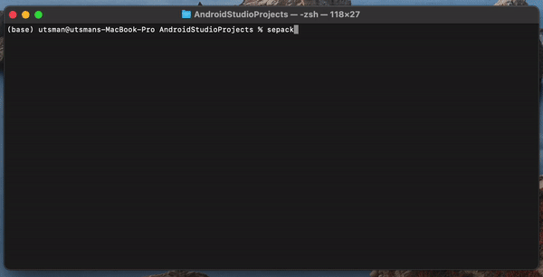
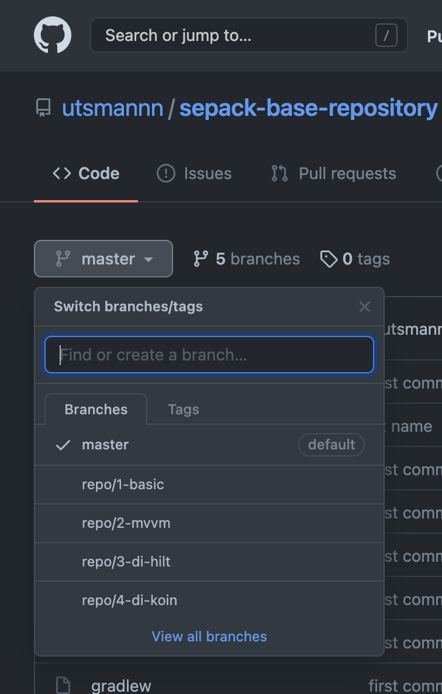

<h1 align="center">
  Android Sepack
</h1>

<p align="center">
  
</p>

<p align="center">
  <a href="https://www.npmjs.com/package/sepack"></a>
  <a href="https://www.npmjs.com/package/sepack"></a>
  <a href="LICENSE"></a>
  <a href="https://github.com/utsmannn/android-sepack/pulls"></a>
  <a href="https://twitter.com/utsmannn"></a>
  <a href="https://github.com/utsmannn"></a>
  <h3 align="center">Tool for generate android project base on MVVM, debug and install project without Android Studio</h3>
</p>

<p align="center">
  
</p>

---

This project tested on Macos and Windows.

### Setup

```
npm install -g sepack
```

### Usage

For start create project <br>
https://www.youtube.com/watch?v=MZR4csYujsY

```
cd your-android-folder-project
sepack create
```

For build project after creating <br>
https://www.youtube.com/watch?v=JlhsQRDc9o0

```
sepack build
```

For run project on device/emulator <br>
https://www.youtube.com/watch?v=XKeanRz7KOA

```
sepack run
```

### Options and arguments

- See `sepack --help` for more options
- See `sepack build --help` for more options build
- See `sepack run --help` for more options run

#### Build

For build android project, type `sepack build`. This command will be generate `local.properties`, setup android sdk and run build task like android studio

#### Run

Run command same as run task in android studio. Type `sepack run`

#### Table

| Command         | Options             | Description                             |
| --------------- | ------------------- | --------------------------------------- |
| `sepack create` |                     | Show create project wizard              |
| `sepack build`  |                     | Build android project                   |
|                 | `--sdk` or `s`      | With path android sdk                   |
|                 | `--checksdk` or `c` | Check current path android sdk          |
| `sepack run`    |                     | Install and run application             |
|                 | `--resume` or `r`   | Resume, run with skip build and install |
|                 | `--log` or `l`      | Show log                                |
|                 | `--tag` or `t`      | Filter by tag                           |
|                 | `--verbose` or `v`  | Verbose level                           |
|                 | `--debug` or `d`    | Debug level                             |
|                 | `--info` or `i`     | Info level                              |
|                 | `--warning` or `w`  | Warning level                           |
|                 | `--error` or `e`    | Error level                             |

### Contribute

For contribute this project, please fork and pull request. <br>
If you want to contribute for template, go to base template repository, fork and pull request with new branch with name of template. <br>
Base repository: <br>
https://github.com/utsmannn/sepack-base-repository



### Api

#### Template list

```
GET https://sepacket.herokuapp.com/api/version
```

#### Dependencies version viewer

```
GET https://sepacket.herokuapp.com/api/dependencies?search={queries}
```

---

```
Copyright 2020 Muhammad Utsman

Licensed under the Apache License, Version 2.0 (the "License");
you may not use this file except in compliance with the License.
You may obtain a copy of the License at

    http://www.apache.org/licenses/LICENSE-2.0

Unless required by applicable law or agreed to in writing, software
distributed under the License is distributed on an "AS IS" BASIS,
WITHOUT WARRANTIES OR CONDITIONS OF ANY KIND, either express or implied.
See the License for the specific language governing permissions and
limitations under the License.
```
